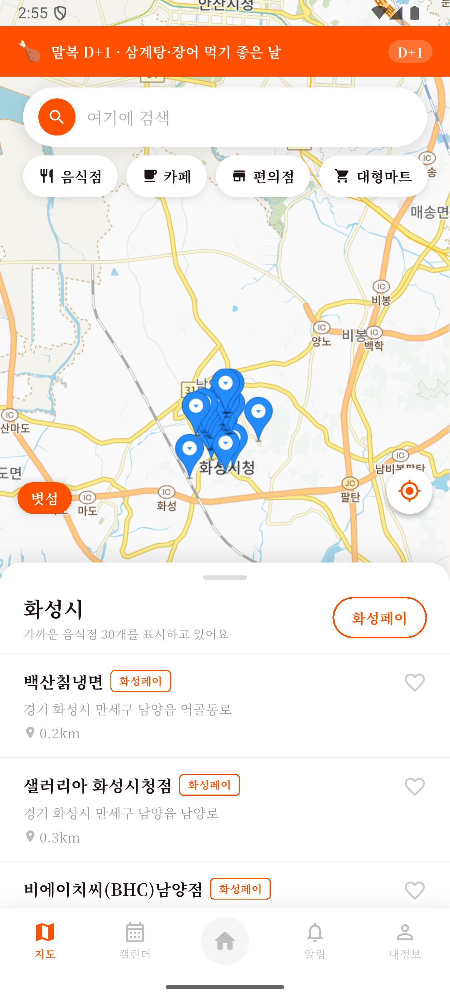
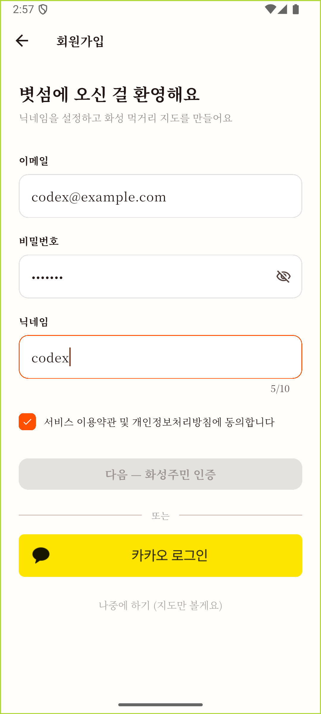
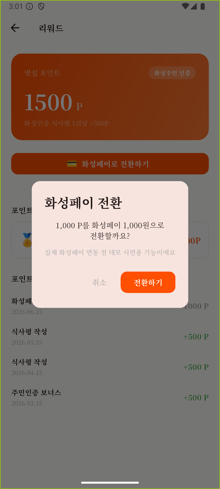

# 볏섬

> 화성시 공공데이터 기반 지역 먹거리 지도 플랫폼  
> 26년 여름학기 AI화성챌린지 — 팀 OPUS

---

## 프로젝트 소개

화성시에 사는 사람은 근처에 뭐가 있는지 모르고, 놀러 온 사람은 축제 와서 결국 편의점에서 먹는다.  
두 사람의 서로 다른 문제를 하나의 지도로 푼다.

**볏섬**은 화성시 향토음식 **볏섬떡**에서 이름을 따왔다.  
볏섬떡은 마도면 금당골에서 풍농을 기원하며 만들어 먹던 전통 음식으로,  
떡방아 찧는 토끼를 주황색 마스코트로 삼아 화성(Mars)의 붉은 행성 색과도 자연스럽게 연결된다.

- 화성페이 가맹점을 지도에서 바로 확인
- 말복이면 삼계탕, 축제 기간이면 주변 맛집 자동 추천
- 화성 주민이 직접 남긴 인증 리뷰로 신뢰 확보

---

## 앱 화면

2026년 8월 16일 Android 에뮬레이터에서 `feat/frontend` 브랜치를 직접 빌드해 확인한 화면이다.

| 홈 | 음식점 지도 |
|---|---|
|  |  |

| 회원가입 입력 검증 | 화성페이 전환 데모 |
|---|---|
|  |  |

> 화성페이 전환은 실제 지급 연동 전 데모 시뮬레이션이며 포인트를 차감하지 않는다.

---

## 팀

| 이름 | 역할 |
|------|------|
| 이재운 | 기획 · 발표 |
| 최상훈 | 디자인 (Figma) |
| 박성원 | 프론트엔드 · API 연결 |
| 궉기원 | 백엔드 |

**미팅:** Discord

---

## 기술 스택

| 영역 | 기술 |
|------|------|
| 모바일 | Flutter (iOS · Android) |
| 백엔드 | Python FastAPI |
| 패키지 관리 | uv |
| ORM | SQLAlchemy + Alembic |
| DB | PostgreSQL |
| 지도 | 카카오맵 API |
| AI | Claude API (공공데이터 정제) |
| 배포 | Render (백엔드) |

---

## 디자인 시스템

| 항목 | 값 |
|------|-----|
| 액센트 | `#FF4F00` (화성 오렌지) |
| 배경 | `#FFFEFB` (웜 크림) |
| 본문 | `#201515` (커피 잉크) |
| 폰트 | Noto Serif KR 400 / 700 |
| 모서리 반경 | 12px 통일 |

---

## 프로젝트 구조

```
hwaseong-eats/
├── .gitignore
├── README.md
│
├── frontend/                        # Flutter 앱 (iOS · Android)
│   ├── CLAUDE.md                    # AI 협업 가이드 (디자인 시스템, 코딩 규칙)
│   ├── pubspec.yaml                 # Flutter 패키지 관리
│   ├── .env.example                 # 환경변수 예시
│   ├── assets/
│   │   └── fonts/                   # NotoSerifKR 폰트
│   └── lib/
│       ├── main.dart                # 앱 진입점
│       ├── core/
│       │   ├── theme.dart           # AppColors, AppTheme
│       │   └── constants.dart       # API 엔드포인트, 앱 상수
│       ├── screens/                 # 화면 (지도, 상세, 리뷰, 리워드 등)
│       ├── widgets/                 # 재사용 위젯
│       ├── models/                  # JSON 파싱 데이터 클래스
│       ├── services/
│       │   └── api_service.dart     # Dio 기반 HTTP 통신
│       └── providers/               # Riverpod 전역 상태관리
│
├── backend/                         # FastAPI 서버 (Render 배포)
│   ├── README.md                    # 백엔드 실행법·API 명세
│   ├── pyproject.toml               # uv 패키지 관리
│   ├── alembic/versions/            # DB 마이그레이션
│   ├── tests/                       # 테스트 94개
│   └── app/
│       ├── main.py                  # FastAPI 앱 진입점
│       ├── database.py              # DB 연결, 세션 관리
│       ├── core/                    # 상수, 인증, 요청제한, 재시도
│       ├── models/                  # SQLAlchemy 테이블 정의
│       ├── schemas/                 # Pydantic 요청·응답 스키마
│       ├── routers/                 # API 엔드포인트
│       └── services/                # 데이터 수집·지오코딩·포인트
│
└── docs/                            # 개발 가이드 문서
    ├── 시스템아키텍처.md
    ├── 백엔드-작업기록.md            # 작업 내역·판단 근거·남은 과제
    ├── backend-setup.md             # uv 설치 및 환경 세팅
    ├── sqlalchemy-guide.md          # SQLAlchemy 사용법
    ├── alembic-guide.md             # 마이그레이션 가이드
    └── backend-crud.md              # CRUD 구현 패턴
```

---

## 시작하기

### 백엔드

```bash
cd backend

# 1. 의존성 설치
uv sync

# 2. 환경변수 설정
cp .env.example .env
# .env 파일 열어서 DATABASE_URL, JWT_SECRET 입력

# 3. DB 마이그레이션
uv run alembic upgrade head

# 4. 서버 실행
uv run uvicorn app.main:app --reload
```

API 문서: http://localhost:8000/docs
자세한 내용은 [backend/README.md](backend/README.md)

**운영 서버가 이미 떠 있어서 프론트는 이걸 그대로 쓰면 된다.**

```
https://hwaseong-eats-api.onrender.com
```

### 프론트엔드

```bash
cd frontend

# 1. 의존성 설치
flutter pub get

# 2. 환경변수 설정
cp .env.example .env
# .env 파일 열어서 API 키 입력

# 3. 앱 실행
flutter run
```

---

## 브랜치 전략

```
main        ← 최종 안정본 (발표·제출용)
dev         ← 통합 개발
feat/기능명  ← 기능 개발 후 dev로 PR
```

- `main` 에 직접 푸시 금지, 반드시 PR로 머지
- 기능 완성 → `dev` PR → 확인 후 → `main` 머지

---

## 진행 상황

| 영역 | 상태 |
|---|---|
| 백엔드 DB·데이터 | ✅ 화성시 업소 48,606건, 좌표 27,387건 |
| 음식점 조회 API | ✅ 필터·검색·거리순 |
| 회원가입·로그인 | ✅ 이메일 + 비밀번호 |
| 식사평·포인트 | ✅ 화성인증 시 500P, 평균 별점 집계 |
| 리워드 (내역·전환) | ✅ 1,000P 단위 전환 |
| 절기·축제 | ✅ 17건, 오늘 기준 자동 판정 |
| 프론트 연동 | ⬜ |

---

## 문서

- [백엔드 README](backend/README.md) — 실행법·API 명세
- [백엔드 작업기록](docs/백엔드-작업기록.md) — 작업 내역·판단 근거·남은 과제
- [시스템 아키텍처](docs/시스템아키텍처.md)
- [백엔드 세팅 가이드](docs/backend-setup.md)
- [SQLAlchemy 가이드](docs/sqlalchemy-guide.md)
- [Alembic 마이그레이션 가이드](docs/alembic-guide.md)
- [백엔드 CRUD 가이드](docs/backend-crud.md)
